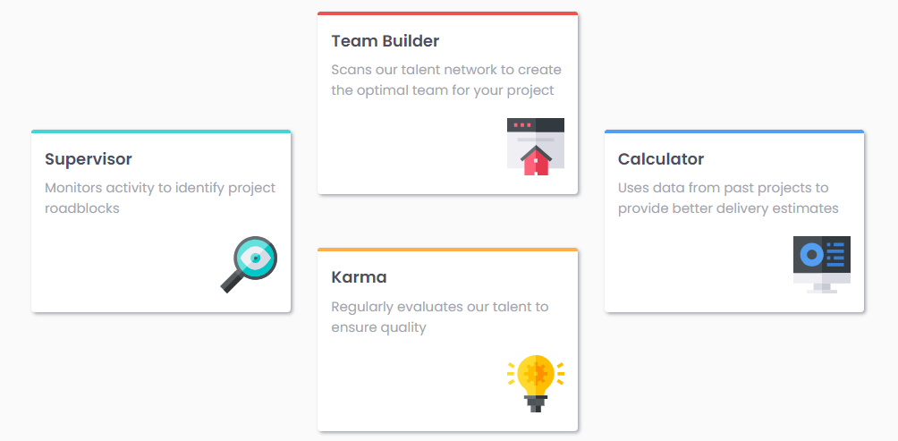

# Frontend Mentor - Four card feature section solution

This is a solution to the [Four card feature section challenge on Frontend Mentor](https://www.frontendmentor.io/challenges/four-card-feature-section-weK1eFYK). Frontend Mentor challenges help you improve your coding skills by building realistic projects. 

## Table of contents

  - [Screenshot](#screenshot)
  - [Links](#links)
  - [Built with](#built-with)
  - [What I learned](#what-i-learned)
  - [Useful resources](#useful-resources)
  - [Author](#author)

### Screenshot

### Links

- Live Site URL: [live site URL](https://four-card-feature-front.netlify.app/)

### Built with

- HTML markup
- Pure CSS

### What I learned

Use this section to recap over some of your major learnings while working through this project.
relative units and css grid

### Useful resources

- [W3schools](https://www.w3schools.com/) - W3Schools is optimized for learning and training.
- [MDN](https://developer.mozilla.org/en-US/) - Resources for Developers, by Developers

## Author
- github - [Ziad Saied](https://github.com/ZiadSaied321)
- Frontend Mentor - [@ZiadSaied321](https://www.frontendmentor.io/profile/ZiadSaied321)