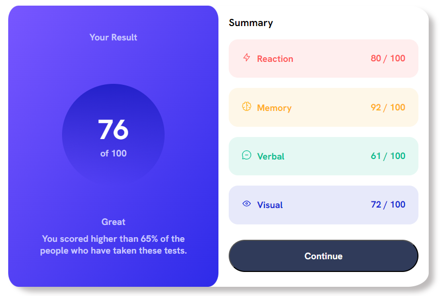

# Frontend Mentor - Results summary component solution

This is a solution to the [Results summary component challenge on Frontend Mentor](https://www.frontendmentor.io/challenges/results-summary-component-CE_K6s0maV). Frontend Mentor challenges help you improve your coding skills by building realistic projects. 

## Table of contents


  - [Screenshot](#screenshot)
  - [Links](#links)
  - [Built with](#built-with)
  - [What I learned](#what-i-learned)
  - [Useful resources](#useful-resources)
  - [Author](#author)


### Screenshot



### Links

- Live Site URL: [live site URL](https://result-component-frontend-mentor.netlify.app/)


### Built with

- HTML markup
- Pure CSS

### What I learned

Use this section to recap over some of your major learnings while working through this project.
color gradients and responsive design using flex

```css
back-ground: linear-gradient(to bottom right, hsl(252, 100%, 67%), hsl(241, 81%, 54%));
```
```css
main.result{
    display: flex;
    flex-direction: column;
    justify-content: space-around;
}
```

### Useful resources

- [W3schools](https://www.w3schools.com/) - W3Schools is optimized for learning and training.
- [MDN](https://developer.mozilla.org/en-US/) - Resources for Developers, by Developers


## Author

- github - [Ziad Saied](https://github.com/ZiadSaied321)
- Frontend Mentor - [@ZiadSaied321](https://www.frontendmentor.io/profile/ZiadSaied321)
